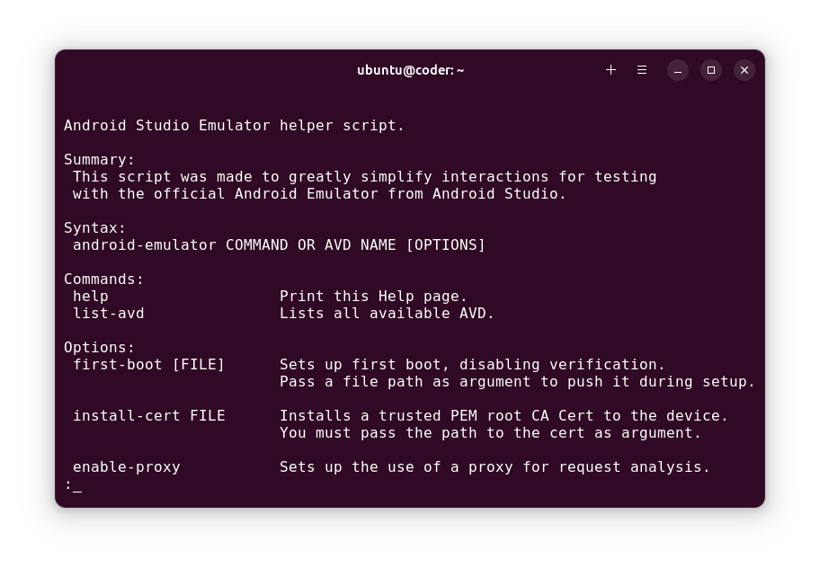
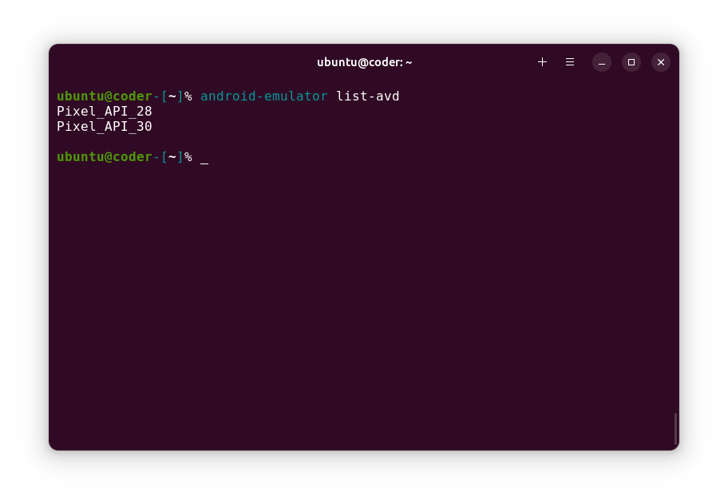

<div align="center">

# Android Emulator Helper Tool
### This script was made to greatly simplify interactions for testing with the official Android Emulator from Android Studio.
[](https://developer.android.com/studio)
[](https://distrowatch.com/dwres.php?resource=popularity)

#

[](#introduction) <sup> **•** </sup>
[](#how-to-run-it) <sup> **•** </sup>
[](#how-to-use-it)

</div>

### Introduction
This is a script created to aid with interactions on Android Emulator from Android Studio. This was created through necessity during my work in cybersecurity, as some tools used for Static Application Security Testing (SAST) and Dynamic Application Security Testing (DAST) use scripts that require access to a writable filesystem on Android, which in Android Studio's Emulator requires manually launching the emulator binary and manipulating it through ADB.

<div align="center">
  
  
</div>

> ###### Dependencies:
> For this script to run, it depends on a few programs: `adb`, `openssl` & `Android Studio`

### How to Run it
To run the script, give executable permission to the file and either run it at the current directory or put it at your user's `~/.local/bin` directory, to be run as a command.

```sh
cd android-emulator

chmod +x $(pwd)/android-emulator
cp $(pwd)/android-emulator ~/.local/bin/android-emulator

android-emulator help
```

###### Examples of the command syntax:
```sh
# Example of first boot of an image, so verification is turned off:
android-emulator Pixel_API_30 first-boot

# Example of installing a trusted root CA Certificate:
android-emulator Pixel_API_30 install-cert ~/cacert.pem
```

### How to Use it
This script relies on you creating an AVD from an Android image that does not have Google Play services, from Android Studio's VM Manager. After running the first-boot script, you will be in an Android environment with a writable system and root access.

Before being able to intercept requests with an intercepting proxy, you need to install your proxy's root CA Certificate. After that shut down the Android VM, so it can be launched with the parameters pointing to the proxy. From there, you are free to run external scripts to get a deeper insight on how an application runs and try to debug it.

<div align="center">

  [](#title)

</div>
